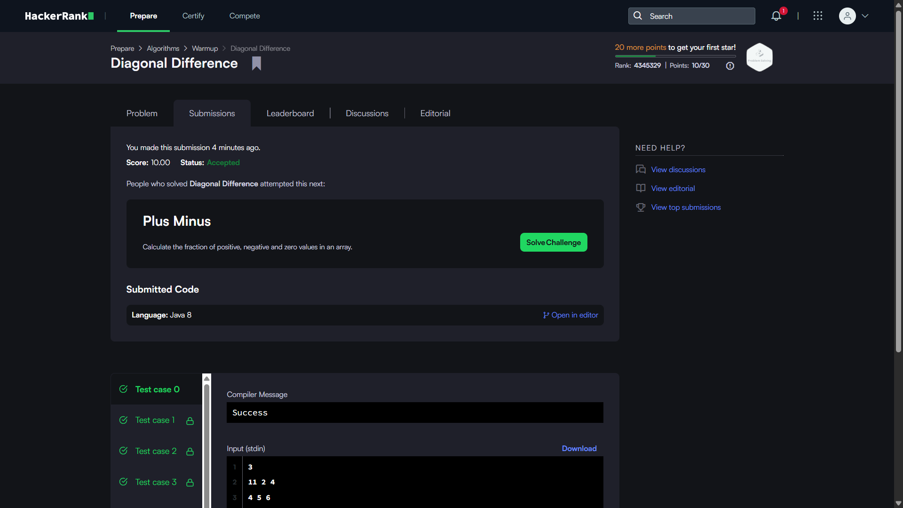
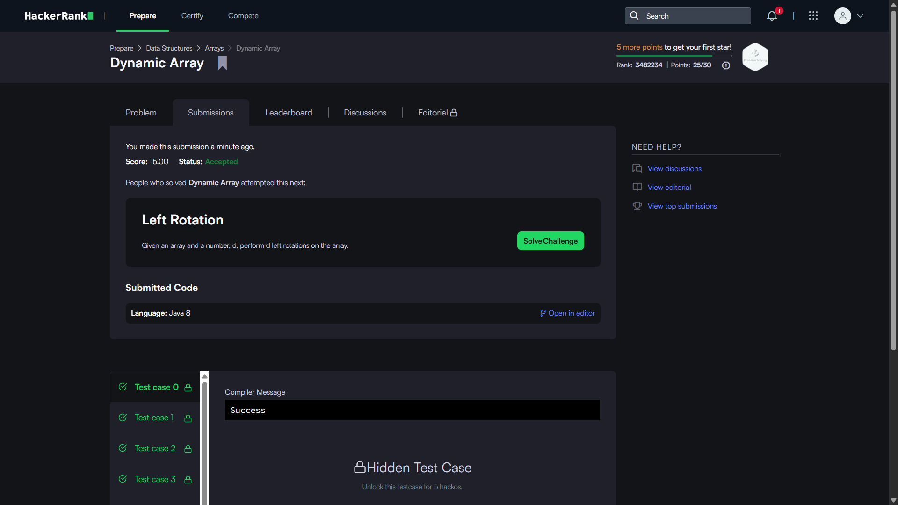
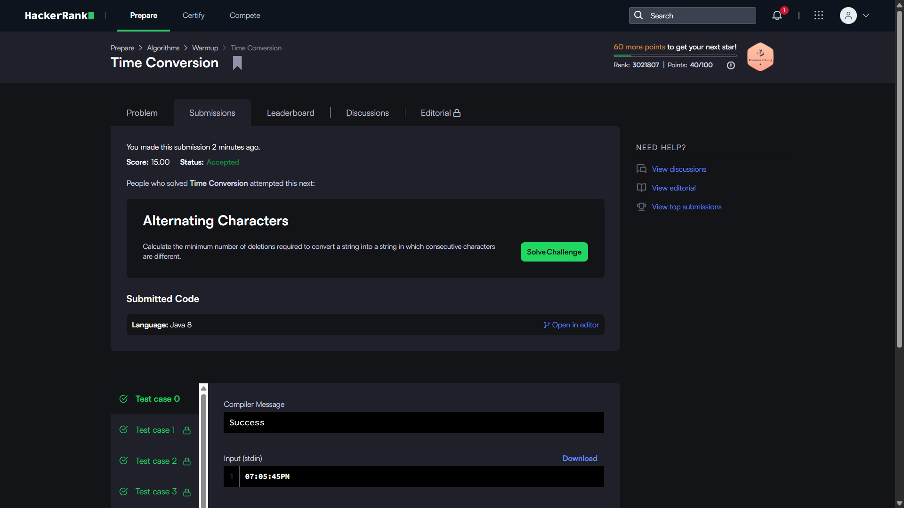
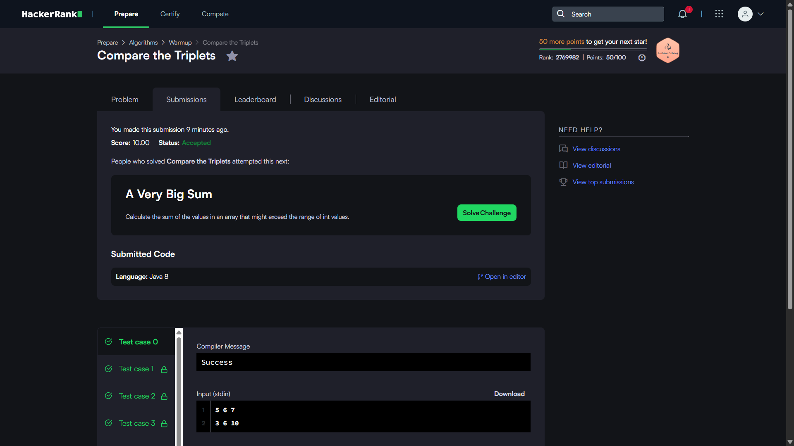
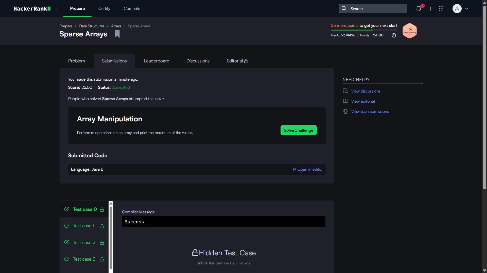

# HackerRank 3rd Sem Portfolio

This repository contains my solutions to the five mandatory HackerRank problems completed as part of Activity 8: HackerRank Algorithmic Problem-Solving & Portfolio Integration.

## HackerRank Profile

[Visit my HackerRank Profile](https://www.hackerrank.com/profile/adarshgadagin)

## Problems Solved

| No. | Problem | Topic | Time Complexity | Space Complexity |
|---|---|---|---|---|
| 1 | Diagonal Difference | 2D Arrays / Matrices | O(N) | O(1) |
| 2 | Dynamic Array | Data Structures / Vectors | O(N + Q) | O(N) |
| 3 | Time Conversion | Strings & Logic | O(1) | O(1) |
| 4 | Compare the Triplets | Basic Implementation | O(1) | O(1) |
| 5 | Sparse Arrays | Hash Maps / Strings | O(N + Q) | O(N) |

## Accepted Submissions

### Diagonal Difference



### Dynamic Array



### Time Conversion



### Compare the Triplets



### Sparse Arrays



## HackerRank Badge


## Repository Structure

```text
HackerRank-3rdSem-Portfolio/
│
├── README.md
│
├── Diagonal-Difference/
│   └── solution.java
│
├── Dynamic-Array/
│   └── solution.java
│
├── Time-Conversion/
│   └── solution.java
│
├── Compare-the-Triplets/
│   └── solution.java
│
├── Sparse-Arrays/
│   └── solution.java
│
└── screenshots/
    ├── diagonal-difference.png
    ├── dynamic-array.png
    ├── time-conversion.png
    ├── compare-the-triplets.png
    ├── sparse-arrays.png
    └── badge.png